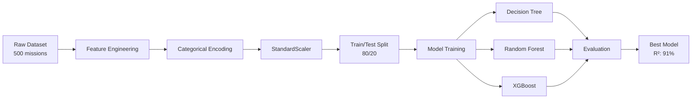

<div align="center">

# 🚀 AI Space Mission Cost Predictor

### *Predicting the Future of Space Exploration with Machine Learning*

[](https://www.python.org/downloads/)
[](https://jupyter.org/)
[](https://scikit-learn.org/)
[](https://xgboost.readthedocs.io/)
[](LICENSE)

[Overview](#-overview) • [Features](#-key-features) • [Model Architecture](#-model-architecture) • [Installation](#-quick-start) • [Results](#-performance-metrics) • [Contributing](#-contributing)

---

</div>

## 🌌 Overview

Whether it's SpaceX's revolutionary Starship catching system or the democratization of space travel, humanity is entering an era where outer space exploration missions are becoming increasingly frequent and accessible. Companies like SpaceX and Blue Origin are working to make space travel more affordable 💸 over time.

This **AI-powered cost predictor** leverages machine learning to forecast space mission costs based on historical mission data, achieving **~90% accuracy** on test data. The model helps mission planners estimate budgets and optimize resource allocation for future space exploration endeavors.

<div align="center">

### 📊 Quick Stats

| Metric | Value |
|--------|-------|
| **Dataset Size** | 500 missions |
| **Best Model** | XGBoost Regressor |
| **R² Score** | ~91% |
| **MAPE** | ~16.7% |
| **Features Used** | 15 engineered features |

</div>

---

## ✨ Key Features

<table>
<tr>
<td width="50%">

### 🎯 Model Capabilities
- 💰 **Cost Prediction**: Accurate forecasting for space mission budgets
- 📈 **Feature Analysis**: Correlation plots and feature importance visualization
- 🔍 **Multi-Model Approach**: Decision Tree → Random Forest → XGBoost progression
- ⚖️ **Regularization**: Ridge regression to handle overfitting

</td>
<td width="50%">

### 🛠️ Technical Features
- 🧪 **Feature Engineering**: Time Efficiency, Energy Demand, Target Distance
- 📊 **Data Scaling**: StandardScaler normalization
- 🎲 **Reproducible Results**: Fixed random state (42)
- 📉 **Overfitting Control**: L2 regularization with XGBoost

</td>
</tr>
</table>

---

## 🏗️ Model Architecture

### 📋 Pipeline Overview



### 🔬 Feature Engineering

The model creates **3 derived features** to capture complex relationships:

| Feature | Formula | Purpose |
|---------|---------|----------|
| **Time Efficiency** | `Scientific Yield / (Mission Duration + ε)` | Measures mission productivity |
| **Energy Demand** | `Payload Weight × Distance from Earth` | Quantifies energy requirements |
| **Target Distance** | `Target Name Code × Distance from Earth` | Captures target-specific distance impact |

### 🤖 Model Comparison

<div align="center">

| Model | R² Score | MAPE | RMSE | Key Advantage |
|-------|----------|------|------|---------------|
| **Decision Tree** | ~75% | ~25% | ~70 | Baseline, interpretable |
| **Random Forest** | **87.11%** | 19.76% | 54.85 | Ensemble reduces variance |
| **XGBoost** | **90.97%** | **16.71%** | **~45** | Best performance, regularized |

</div>

### ⚙️ XGBoost Hyperparameters

```python
XGBRegressor(
    objective='reg:squarederror',
    max_depth=5,
    learning_rate=0.1,
    n_estimators=100,
    reg_lambda=1.0,        # L2 regularization
    random_state=42
)
```

---

## 📊 Dataset Information

### 📁 Dataset: `space_missions_dataset.csv`
- **Size**: 500 space missions
- **Features**: 15 columns (after engineering)
- **Target Variable**: Mission Cost (billion USD)

### 🎯 Input Features

<details>
<summary><b>Click to expand feature list</b></summary>

#### Original Features
- 🌍 **Distance from Earth** (light-years)
- ⏱️ **Mission Duration** (years)
- 🔬 **Scientific Yield** (points)
- 👨‍🚀 **Crew Size**
- ⛽ **Fuel Consumption** (tons)
- 📦 **Payload Weight** (tons)
- 📅 **Launch Year**

#### Categorical Features (Encoded)
- 🎯 Target Type Code
- 🚀 Mission Type Code
- 🛸 Launch Vehicle Code
- 🪐 Target Name Code
- 🆔 Mission ID Code

#### Engineered Features
- ⚡ Time Efficiency
- 🔋 Energy Demand
- 📏 Target Distance

</details>

---

## 🚀 Quick Start

### 📦 Installation

```bash
# Clone the repository
git clone https://github.com/yourusername/Space-Mission-Cost-Predictor.git
cd Space-Mission-Cost-Predictor

# Install required packages
pip install pandas seaborn matplotlib numpy scikit-learn xgboost jupyter
```

### ▶️ Running the Notebooks

```bash
# Launch Jupyter Notebook
jupyter notebook

# Or use Jupyter Lab
jupyter lab
```

Then open either:
- **`SMC_Predictor.ipynb`** - Original implementation
- **`SMC_Predictor_Regularized.ipynb`** - Regularized version with Ridge regression

### 📝 Usage

1. **Run cells sequentially** from top to bottom
2. The notebook will:
   - Load and explore the dataset
   - Engineer features
   - Train multiple models
   - Visualize feature importance
   - Display performance metrics

---

## 📈 Performance Metrics

### 🏆 XGBoost Results (Best Model)

<div align="center">

| Metric | Score | Interpretation |
|--------|-------|----------------|
| **R² Score** | 90.97% | Explains 91% of variance in mission costs |
| **MAPE** | 16.71% | Average prediction error of ~17% |
| **Training Split** | 80/20 | 400 training, 100 test missions |

</div>

### 📊 Evaluation Visualizations

Both notebooks include:
- ✅ Feature importance plots (horizontal bar charts)
- ✅ Correlation heatmaps
- ✅ Pair plots for feature relationships
- ✅ Model performance comparisons

---

## 🎯 Key Challenge: Feature Dominance

### Problem
Certain features dominated predictions, leading to overfitting and poor generalization.

### Solution
Two-pronged approach:
1. **Ridge Regression** (`SMC_Predictor_Regularized.ipynb`) - Reduces influence of dominant features
2. **XGBoost L2 Regularization** (`reg_lambda=1.0`) - Penalizes large coefficients

**Result**: Improved generalization while maintaining high accuracy

---

## 🗂️ Project Structure

```
Space-Mission-Cost-Predictor/
│
├── 📊 space_missions_dataset.csv          # Dataset (500 missions)
├── 📓 SMC_Predictor.ipynb                  # Main implementation
├── 📓 SMC_Predictor_Regularized.ipynb      # Regularized version
├── 📄 README.md                            # This file
├── 📄 WARP.md                              # Development guide
└── 📁 .ipynb_checkpoints/                  # Jupyter checkpoints
```

---

## 🛠️ Technologies Used

<div align="center">

### Core Libraries


### Visualization & ML


</div>

---

## 🔬 Reproducibility

To reproduce the exact results:

1. ✅ Use the same library versions (especially `scikit-learn` and `xgboost`)
2. ✅ Maintain `random_state=42` for train/test split
3. ✅ Run all notebook cells sequentially from the beginning
4. ✅ Use the provided hyperparameters for XGBoost

---

## 🤝 Contributing

Contributions are welcome! Here are some ways you can help:

- 🐛 Report bugs and issues
- 💡 Suggest new features or improvements
- 📖 Improve documentation
- 🔧 Submit pull requests

### Development Setup

1. Fork the repository
2. Create a feature branch (`git checkout -b feature/AmazingFeature`)
3. Commit your changes (`git commit -m 'Add some AmazingFeature'`)
4. Push to the branch (`git push origin feature/AmazingFeature`)
5. Open a Pull Request

---

## 📜 License

Distributed under the **MIT License**. See `LICENSE` for more information.

---

## 🌟 Acknowledgments

- 🚀 Inspired by SpaceX, Blue Origin, and the future of accessible space travel
- 📊 Built with open-source ML libraries
- 🌌 Dedicated to advancing space exploration through data science

---

<div align="center">

### ⭐ Star this repository if you found it helpful!

**Made with ❤️ for the future of space exploration**

[⬆ Back to Top](#-ai-space-mission-cost-predictor)

</div>
